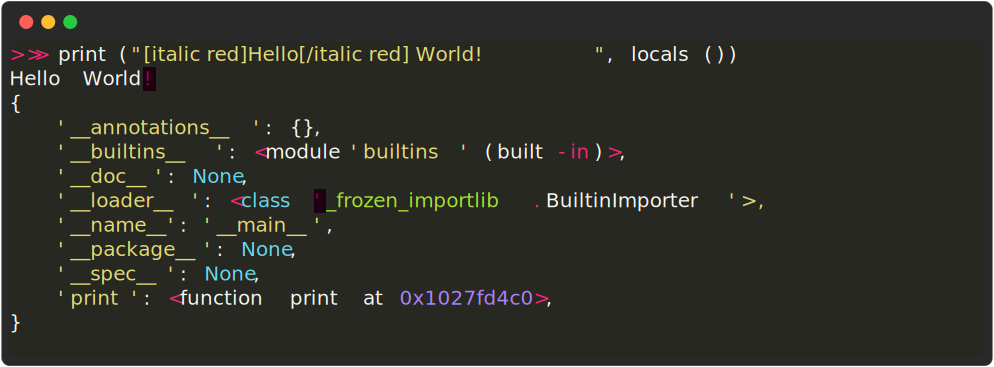

# rich-codex ⚡️📖⚡️

A GitHub Action / command-line tool which generates screengrab images of a terminal window, containing _command outputs_ or _code snippets_.

[](https://pypi.python.org/pypi/multiqc/)
[](https://hub.docker.com/r/ewels/multiqc/)

## <a name='Introduction'></a>Introduction

Rich-click searches markdown code for image embeds with commands or code snippets. It runs these commands and saves a terminal screen-grab at the embedded path.

Typical use cases:

- 📷 Example CLI tool outputs that _automatically stay in sync with your package_
- ♻️ Syntax-highlighted code snippets that are always up to date with your `examples/`
- 🤩 Fast and simple images for your docs with minimal setup

## <a name='Quickstart'></a>Quickstart

1. 📖 Write some markdown docs, use an image tag with a backtick command inside:
   ```markdown
   
   ```
2. 🤖 Add a GitHub Action to automatically run the command, generate the image and commit to the repo:

   ```yaml
   on: [push]
   jobs:
     rich_codex:
       runs-on: ubuntu-latest
       steps:
         - uses: actions/checkout@v3

         - name: Install your custom tools
           run: pip install lolcat

         - name: Generate terminal images with rich-codex
           uses: ewels/rich-codex@v1
           with:
             commit_changes: "true"
   ```

3. 🌈 Enjoy reading your documentation 

<!-- vscode-markdown-toc -->

- [Introduction](#Introduction)
- [Quickstart](#Quickstart)
- [How it works](#Howitworks)
- [GitHub Action](#GitHubAction)
- [Command-line](#Command-line)
  - [Local installation](#Localinstallation)
  - [Docker image](#Dockerimage)
- [Generating images](#Generatingimages)
  - [Markdown](#Markdown)
  - [Command-line / action inputs](#Command-lineactioninputs)
  - [YAML config files](#YAMLconfigfiles)
- [Avoiding superfluous changes](#Avoidingsuperfluouschanges)
  - [Percentage change in file contents](#Percentagechangeinfilecontents)
  - [Regular expression matches](#Regularexpressionmatches)
- [Safety](#Safety)
  - [Prompts for commands](#Promptsforcommands)
  - [Banned commands](#Bannedcommands)
- [Reference docs](#Referencedocs)
  - [GitHub Action Inputs](#GitHubActionInputs)
- [Troubleshooting](#Troubleshooting)
  - [Output has no colour](#Outputhasnocolour)

<!-- vscode-markdown-toc-config
	numbering=false
	autoSave=true
	/vscode-markdown-toc-config -->
<!-- /vscode-markdown-toc -->

## <a name='Howitworks'></a>How it works

Rich-codex is a command-line tool that you can via a **GitHub action** or as a **command line tool**. It works with any markdown (including GitHub READMEs).

It collects either commands or code snippets, together with output filenames and configuration options. Commands are run in a subprocess and the standard output & standard error collected. These are then rendered as an image using [Textualize/rich](https://github.com/textualize/rich).

> Rich-codex creates the images that your markdown docs expect. It doesn't require a HTML build-step and doesn't make any changes to your markdown or its output. As such, it's compatible with _**any documentation engine**_, including rendering markdown on [github.com](https://github.com).

Rich-codex needs **inputs** (commands / snippets) and **output filenames** to work. These can be configured in four different ways:

- 🖼 [Markdown images](#markdown)
  - Search markdown files for image tags with command alt text. eg: ``  ``
- 💬 [Markdown comments](#markdown)
  - Search markdown files for special HTML comments.
- ➡️ [Command-line / action inputs](#command-line--action-inputs)
  - Specify a command or snippet using the action `with` inputs.
- ⚙️ [Config files](#yaml-config-files)
  - Use one or more YAML config files for multiple images and more complex customisation.

Images can be generated as SVG, PNG or PDF (detected by filename extension).

## <a name='GitHubAction'></a>GitHub Action

Rich-codex was primarily designed to run automatically with GitHub actions, to keep your screenshots up to date for you.

If there are changes to the images, the action can exit with an error (default) or automatically commit the updates.

A very simple example is shown below. This action looks for rich-codex content in the repo, generates the images and then creates and pushes a new commit with any changes.

```yaml
on: [push]
jobs:
  rich_codex:
    runs-on: ubuntu-latest
    steps:
      - name: Check out the repo
        uses: actions/checkout@v3

      - name: Install your custom tools
        run: pip install .

      - name: Generate terminal images with rich-codex
        uses: ewels/rich-codex@v1
        with:
          commit_changes: "true"
```

See the [Reference Docs](#github-action-inputs) below for a description of all customisation inputs available.

For a more complex example, see [`.github/workflows/examples.yml`](.github/workflows/examples.yml) in this repository.

> ❗️ **Note:** For GitHub Actions to push commits to your repository, you'll need to set _Workflow permissions_ to _Read and write permissions_ under _Actions_ -> _General_ in the repo settings. See the [GitHub docs](https://docs.github.com/en/repositories/managing-your-repositorys-settings-and-features/enabling-features-for-your-repository/managing-github-actions-settings-for-a-repository#configuring-the-default-github_token-permissions).

## <a name='Command-line'></a>Command-line

In addition to the GitHub Action, rich-codex is also a stand-alone command line tool.

You are welcome to use it locally, for example when first writing new documentation and generating initial images to check their output.

> 💥⚠️ **Warning** ⚠️💥
>
> Please remember that rich-codex is designed to _**run arbitrary commands**_ that it finds within documentation for your project.
>
> You alone are responsible for any damage you cause to your computer! 🙃 Running rich-codex entirely within GitHub Actions is recommended 👍🏻

### <a name='Localinstallation'></a>Local installation

You can install `rich-codex` from the [Python Package Index (PyPI)](https://pypi.org/project/rich-codex/) with `pip` or equivalent.

```bash
pip install rich-click
```

At its simplest, the command-line tool runs without any arguments and recursively searches the current working directory for anything it recognises:

```bash
rich-codex
```

Behaviour can be customised with command-line flags or by setting environment variables, see `rich-codex --help`:


#### <a name='RequirementsforPNGPDFoutputs'></a>Requirements for PNG / PDF outputs

If you wish to generate `PNG` or `PDF` images (not just `SVG`) then there are a few additional requirements. Conversion is done using [CairoSVG](https://cairosvg.org/). First, install rich-click with the `cairo` [extra](https://packaging.python.org/en/latest/tutorials/installing-packages/#installing-setuptools-extras):

```bash
pip install rich-click[cairo]
```

You'll then probably need some additional libraries, see the [Cairo documentation](https://cairosvg.org/documentation/):

> CairoSVG and its dependencies may require additional tools during the installation: a compiler, Python headers, Cairo, and FFI headers. These tools have different names depending on the OS you are using, but:
>
> - on Windows, you’ll have to install Visual C++ compiler for Python and Cairo;
> - on macOS, you’ll have to install cairo and libffi (eg. with [Homebrew](https://brew.sh): `brew install cairo`);
> - on Linux, you’ll have to install the cairo, python3-dev and libffi-dev packages (names may vary for your distribution).

Installation can be messy, so be prepared to do a bit of googling to get things to work. Remember that running rich-codex with the `-v` flag to get verbose logging can give you more information about what's going wrong (if anything).

You'll also need Fira Code installed, an open-licence font: [GitHub repo](https://github.com/tonsky/FiraCode) / [Google Fonts](https://fonts.google.com/specimen/Fira+Code).

### <a name='Dockerimage'></a>Docker image

There is a docker image for running rich-codex, however - note that if you're trying to run commands, they will likely not be available in the container! So this is best used for code snippets or common linux tools. Alternatively, you can build your own docker image using this as a base, with additional dependencies installed.

To run, a typical command would be:

```bash
docker run -i -v `pwd`:`pwd` -w `pwd` -u $(id -u):$(id -g) ewels/richcodex
```

- The `-i` flag enables stdin so that you can confirm running commands (alternatively, use `--no-confirm` at the end)
- The `-v` argument tells Docker to bind your current working directory (`pwd`) to the same path inside the container, so that files created there will be saved to your local file system outside of the container.
- `-w` sets the working directory in the container to this path, so that it's the same as your working directory outside of the container.
- `-u` sets your local user account as the user inside the container, so that any files created have the correct ownership permissions.

You can then pass environment variables with the `-e` flag to customise behaviour. See the usage instructions below for the available environment variables.

## <a name='Generatingimages'></a>Generating images

### <a name='Markdown'></a>Markdown

#### <a name='Runningcommands'></a>Running commands

If you write markdown with images that contain _just_ a `backtick command` as the alt-text, rich-codex will find them.

For example, the following markdown will generate `docs/img/rich-codex-help.svg` (the image shown above) based on the output of the command `rich-codex --help`:

```markdown
Wow, this documentation is really getting meta!

```

Rich-codex bundles [rich-cli](https://github.com/Textualize/rich-cli) for convenience, so you can easily produce screenshots of files:

```markdown

```


> 💡 Use the `--force-terminal` flag to keep colours in your screenshots

You can also add [title text](https://daringfireball.net/projects/markdown/syntax#img) in quotes after the filename, which will be used in the top menu bar of the screenshot terminal.
This can be useful when adding lots of command markup to get a good screenshot. For example:

```markdown
You don't always want people to see the exact command you used, after all.

```


Finally, you can use a HTML comment in a line above the image to set config attributes for this image only.
The comment should begin with `RICH-CODEX` and then have `KEY=VALUE` pairs. Available configs are:

- `SKIP`: Skip this image
- `MIN_PCT_DIFF`: Minimum file percentage change required to update image
- `SKIP_CHANGE_REGEX`: Skip image update if file changes match regex
- `TERMINAL_WIDTH`: Set terminal width
- `TERMINAL_THEME`: Set terminal theme
- `USE_PTY`: Use a pseudo-terminal for commands (may capture coloured output)

For example:

<!-- prettier-ignore-start -->

```markdown
<!-- RICH-CODEX TERMINAL_WIDTH=60 TERMINAL_THEME=MONOKAI -->

```

<!-- RICH-CODEX TERMINAL_WIDTH=60 TERMINAL_THEME=MONOKAI -->


<!-- prettier-ignore-end -->

#### <a name='Codesnippets'></a>Code snippets

In addition to running commands, you can format code blocks or "snippets".

To do this, make the `<!-- RICH-CODEX` code comment multi-line. Config key-pairs stay on the first line and anything on subsequent lines before the closing `-->` will be treated as the snippet. Then follow the code comment with a markdown image tag (again, the filename will be taken for the generated image).

> The alt-text for the markdown image embed doesn't matter for snippets. However, if it has a command in backticks then this will take priority over the snippet.

Use `SNIPPET_SYNTAX` to define a language to format in. Syntax highlightin defaults to JSON if the snippet is valid JSON, and is otherwise uncoloured. All other key-value pairs above also work for snippets.

For example:

<!-- prettier-ignore-start -->

```markdown
<!-- RICH-CODEX SNIPPET_SYNTAX=python TERMINAL_WIDTH=80
>>> print("[italic red]Hello[/italic red] World!", locals())
Hello World!
{
    '__annotations__': {},
    '__builtins__': <module 'builtins' (built-in)>,
    '__doc__': None,
    '__loader__': <class '_frozen_importlib.BuiltinImporter'>,
    '__name__': '__main__',
    '__package__': None,
    '__spec__': None,
    'print': <function print at 0x1027fd4c0>,
}
-->

```

<!-- RICH-CODEX SNIPPET_SYNTAX=python TERMINAL_WIDTH=80
>>> print("[italic red]Hello[/italic red] World!", locals())
Hello World!
{
    '__annotations__': {},
    '__builtins__': <module 'builtins' (built-in)>,
    '__doc__': None,
    '__loader__': <class '_frozen_importlib.BuiltinImporter'>,
    '__name__': '__main__',
    '__package__': None,
    '__spec__': None,
    'print': <function print at 0x1027fd4c0>,
}
-->


<!-- prettier-ignore-end -->

### <a name='Command-lineactioninputs'></a>Command-line / action inputs

You can generate images by providing a command or snippet directly to the CLI at run time.

You need the following command line flags / environment variables / GitHub Action inputs

- One of:
  - `--command` / `$COMMAND` / `command`
  - `--snippet` / `$SNIPPET` / `snippet`
- And:
  - `--img_paths` / `$IMG_PATHS` / `img_paths`

### <a name='YAMLconfigfiles'></a>YAML config files

_Under construction, coming soon.._

## <a name='Avoidingsuperfluouschanges'></a>Avoiding superfluous changes

You may find that your screenshots are changing every time you run rich-codex, even though no relevant changes have occured within your code. This could be because the screenshots include timestamps or some other live data.

To avoid doubling your commit count with changes that you don't care about, rich-codex has two mechanisms which you can use to ignore changes:

- ⚖️ Percentage change in file contents
- 🔎 Regular expression matches

### <a name='Percentagechangeinfilecontents'></a>Percentage change in file contents

When you run rich-codex, any new images created will generate log messages that look like this:
`Saved: 'docs/img/rich-codex-snippet-title.svg' (4.63% change)`.
This percentage change is calculated using the [python-Levenshtein](https://github.com/ztane/python-Levenshtein) package, comparing the raw bytes of the two files.

By default, any new files with 0.00% change will be ignored. If you find that you have screenshots changing by the same small percentage every time, you can raise this threshold by setting `--min-pct-diff` (cli) / `MIN_PCT_DIFF` (env var / markdown comment) / `min_pct_diff` (GitHub action input).

For example, if a timestamp caused this file to change by 4.34% on every commit, those changes could be ignored as follows:

```markdown
<!-- RICH-CODEX MIN_PCT_DIFF=5 -->


```

### <a name='Regularexpressionmatches'></a>Regular expression matches

Percentage changes in files is quick and simple, but a little crude. If you prefer, you may be able to use regular expressions instead with `--skip-change-regex` (cli) / `SKIP_CHANGE_REGEX` (env var / markdown comment) / `skip_change_regex` (GitHub action input).

If there is a > 0% change in files, a rich diff will be generated. Any diff lines matching the supplied regexes will be removed and if none remain, the changeset will be ignored.

Rich-codex ships with one default, applied for PDF files: if the only change is a line with `"/CreationDate"` then the changeset will be ignored.

> ⏱ Please note that generating diffs between file pairs can be very slow. Use with caution.

## <a name='Safety'></a>Safety

Reminder: rich-codex runs arbitrary commands found in documentation on your host system. You are responsible for ensuring that it does not do any damage.

### <a name='Promptsforcommands'></a>Prompts for commands

When rich-click runs interactively, it collects all commands to be run and presents these to you, the user. You then need to choose whether to run all commands, choose some or to ignore all of them.

### <a name='Bannedcommands'></a>Banned commands

As a very basic safety step, rich-click attempts to ignore any commands that start with the following: `rm`, `cp`, `mv`, `sudo`. This is to avoid accidentally messing with your local system.

Please note that this is only for rough protection against accidents and would be easy for a malicious user to circumvent _(for example, putting these commands in a bash script and running that)_.

## <a name='Referencedocs'></a>Reference docs

### <a name='GitHubActionInputs'></a>GitHub Action Inputs

- `search_include`: Glob patterns to files in which to search for rich-codex comments
- `search_exclude`: Glob patterns to exclude from search for rich-codex comments
- `no_search`: Set to 'true' to disable searching for rich-codex comments
- `command`: Specify a command to run to capture output
- `snippet`: Literal code snippet to render
- `snippet_syntax`: Language to use for snippet sytax highlighting
- `img_paths`: Path to image filenames if using 'command' or 'snippet'
- `clean_img_paths`: Remove any matching files that are not generated
- `rc_configs`: Paths to YAML config files
- `min_pct_diff`: Minimum file percentage change required to update image
- `skip_change_regex`: Skip image update if file changes match regex
- `width`: Width of the terminal
- `theme`: Colour theme
- `use_pty`: Use a pseudo-terminal for commands (may capture coloured output)
- `log_verbose`: Print verbose output to the console.
- `commit_changes`: Automatically commit changes to the repository
- `error_changes`: Exit with an error if changes are found (Ignored if 'commit_changes' is true)

## <a name='Troubleshooting'></a>Troubleshooting

### <a name='Outputhasnocolour'></a>Output has no colour

By default, rich-codex runs commands in a Python `subprocess`. This is not an interactive termainal, and as such many command-line tools will disable coloured output.

This is best solved at the tool level if possible, by telling the tool to force coloured output. However, if this is not possible then you can use the `--use-pty` flag / `USE_PTY` env var. This uses a [Python `pty` pseudo-terminal](https://docs.python.org/dev/library/pty.html) instead of [`subprocess`](https://docs.python.org/dev/library/subprocess.html) which may trick your tool into keeping coloured output.

Please note that commands with pipes cannot be used in this mode currently - the pipes will be treated as literal strings (and probably other special bash characters too). If anyone knows how to resolve this, please let me know!
