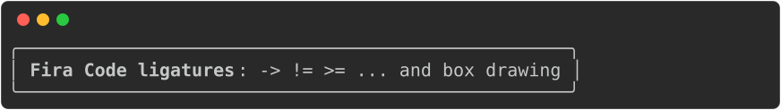

## Embedding the terminal font

Rich, and so rich-codex, render terminal text using [Fira Code](https://github.com/tonsky/FiraCode)
and window titles using Arial.
Rich writes a `@font-face` rule into the SVG that points at a local copy of the font, with a CDN URL as a backup.
This is fine if the SVG is embedded in a page, but generally not ok if the svg is rendered
with an `` tag: these run in "secure static mode", blocking external requests.
GitHub also serves images through its camo proxy, so the CDN URL never loads.

This is problematic because Rich positions each chunk of text using an absolute
`x` coordinate, calculated from the character width it expects.
Browser fallback fonts have different widths, so the glyphs drift inside each chunk and
the box-drawing characters no longer join up.

To solve this, rich-codex embeds the font in the SVG instead, as a base64 data URI.
SVGs rendered in `` mode can use this, so the image renders the same way for every
reader.

Arial cannot be bundled because it is proprietary, so rich-codex embeds
[Inter](https://rsms.me/inter/) instead and rewrites the title rule to use it.

Only the characters that the image uses are embedded. The bold weight is left out
if the image contains no bold text.
Embedding is on by default. To turn it off and go back to Rich's linked font, use
`--no-embed-font` / `$EMBED_FONT` / `embed_font` (CLI, env var, action/config):

```yaml
embed_font: false
```

The two images below are the same command, rendered both ways. The ligatures
are the clearest sign, with `->` and `!=` drawn as `→` and `≠`.

Note that these images will look identical if you have Fira Code installed.

<!-- prettier-ignore-start -->
Default, embedding Fira Code:

```markdown
<!-- RICH-CODEX { terminal_width: 70, hide_command: true } -->
![`rich --print "[bold]Fira Code ligatures[/]: -> != >= ... and box drawing" --panel rounded --force-terminal`](../img/embed-font.svg)
```


With `embed_font` set to `false`:

```markdown
<!-- RICH-CODEX { terminal_width: 70, hide_command: true, embed_font: false } -->
![`rich --print "[bold]Fira Code ligatures[/]: -> != >= ... and box drawing" --panel rounded --force-terminal`](../img/embed-font-off.svg)
```

<!-- prettier-ignore-end -->

### PNG Raster images

PNG files are rasterised using [resvg](https://github.com/linebender/resvg). This doesn't
support `@font-face`, so can't use the embedded font - it has to read fonts
from the machine that renders the image. rich-codex therefore passes resvg its own
copies of Fira Code, Inter and Noto Color Emoji, and tells resvg to ignore the fonts on
the machine. The same output then rasterises the same way anywhere. This matters in CI,
where any change to a file is another commit.

### Emoji, and anything else the fonts do not have

No monospace font includes emoji, so rich-codex
bundles [Noto Color Emoji](https://github.com/googlefonts/noto-emoji).
The three fonts together cover Latin, Greek, Cyrillic, box drawing and
emoji.

Characters outside that set, such as CJK, are blank in PNG output. rich-codex prints a
warning when it finds one:

```
No bundled font can draw 漢 字, so they will be blank in PNG output.
Set '--png-fallback-font' to draw them with a font from this machine.
```

To draw them, set `--png-fallback-font` / `$PNG_FALLBACK_FONT` / `png_fallback_font` (CLI,
env var, action/config) to a font family that is installed on the machine that generates
the images:

```yaml
png_fallback_font: Noto Sans CJK JP
```

This option makes a PNG depend on the machine again, which is why it is off by default.
The GitHub Action runs in a container that carries no fonts of its own, so install one
there first.

<!-- prettier-ignore-start -->
!!! note
    resvg substitutes a font for each character that it cannot draw, then keeps that
    substitute for the characters that follow, for as long as the substitute can draw them.
    A substitute that contains letters would redraw the rest of the line. To prevent that,
    rich-codex moves those characters into a `<text>` element of their own before it
    rasterises the image. This applies only to the copy that goes to the rasteriser. The
    SVG that rich-codex writes is unchanged, and browsers handle the same problem correctly
    on their own.
<!-- prettier-ignore-end -->

### Double-width characters

Rich moves along each line in terminal cells, and an emoji or a CJK character fills two
cells. Rich sizes the SVG's `textLength` by counting characters, so an element that holds
one of these characters is a cell too narrow. Browsers obey `textLength`, so the glyph used
to overlap the text after it and the box drawing stopped lining up. rich-codex corrects the
value, in SVG and PNG output alike.

## File size

Embedding adds 10 KB to 30 KB per image. The exact figure depends on how many different
characters the image uses, and on whether any of them are bold. A window title adds about
6 KB more, for Inter.

| Image                                     | `embed_font: false` |  Default |
| ----------------------------------------- | ------------------: | -------: |
| The panel above (31 characters, bold)     |              3.7 KB |  30.1 KB |
| `rich-codex --help` (70 characters, bold) |             73.0 KB | 101.3 KB |

Turn embedding off if you want smaller files and know that your readers have Fira Code.

## Licence

rich-codex bundles three fonts: [Fira Code](https://github.com/tonsky/FiraCode),
[Inter](https://github.com/rsms/inter) and
[Noto Color Emoji](https://github.com/googlefonts/noto-emoji). All three use the
[SIL Open Font License, Version 1.1](https://scripts.sil.org/OFL), which permits embedding.
Each subset keeps the copyright and licence notice of its font in the `name` table, and
rich-codex repeats the notice in a comment near the top of every SVG that carries a font.
The full licence texts are in the `fonts` directory of the package.

The fonts account for most of the install size. The package is about 3 MB, and would be
about 0.5 MB without them.
