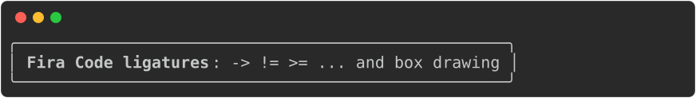

## Embedding the terminal font

SVGs generated by rich-codex are typeset in [Fira Code](https://github.com/tonsky/FiraCode).
By default the image doesn't contain the font, it just links to it: Rich writes a
`@font-face` rule with a `local("FiraCode-Regular")` source and a CDN URL to fall back on.

That works in a browser tab, but not where most people actually see these images.
Markdown renderers put images in an `` tag, and SVGs inside `` are rendered in
_secure static mode_ — no external resource is ever fetched, whatever the CSS says.
GitHub goes further and proxies images through camo, so the CDN is doubly out of reach.

That leaves `local()` as the only source that can resolve, so the image is only correct
on machines that happen to have Fira Code installed. Everywhere else the browser
substitutes another monospace font. Rich places every chunk of text at an absolute `x`
coordinate calculated from the character width it expects, so the substituted glyphs
drift within each chunk, and box-drawing characters come apart at the seams.

Set `--embed-font` / `$EMBED_FONT` / `embed_font` (CLI, env var, action/config) and
rich-codex will put the font _inside_ the SVG instead, as a base64 data URI. A data URI
isn't an external fetch, so `` mode is happy to use it, and the image looks the same
for everyone.

```yaml
embed_font: true
```

Here's the same command rendered both ways. If you have Fira Code installed they look
identical; if you don't, only the second one is still Fira Code — the giveaway being the
ligatures, `->` and `!=` drawn as `→` and `≠`:

<!-- prettier-ignore-start -->
Default:

```markdown
<!-- RICH-CODEX { terminal_width: 70, hide_command: true } -->
![`rich --print "[bold]Fira Code ligatures[/]: -> != >= ... and box drawing" --panel rounded --force-terminal`](../img/embed-font-default.svg)
```


With `embed_font` set to `true`:

```markdown
<!-- RICH-CODEX { terminal_width: 70, hide_command: true, embed_font: true } -->
![`rich --print "[bold]Fira Code ligatures[/]: -> != >= ... and box drawing" --panel rounded --force-terminal`](../img/embed-font.svg)
```

<!-- prettier-ignore-end -->

<!-- prettier-ignore-start -->
!!! note
    This only affects SVG output. PNG and PDF are rasterised by [CairoSVG](https://cairosvg.org),
    which ignores `@font-face` altogether and uses the fonts installed on the machine
    generating them. Those files have never depended on the reader's fonts anyway.
<!-- prettier-ignore-end -->

## Installing the extra

Font subsetting needs [fontTools](https://fonttools.readthedocs.io), which isn't part of
the default install:

```bash
pip install "rich-codex[fonts]"
```

The GitHub Action installs it for you whenever `embed_font` is set.

## File size

Only the characters that the image actually renders are embedded, and the bold weight is
left out entirely if nothing in the image is bold. Even so, embedding is not free — expect
somewhere between 10 KB and 30 KB per image, depending on how many distinct characters the
image uses and whether any of them are bold:

| Image                                     | Default | `embed_font: true` |
| ----------------------------------------- | ------: | -----------------: |
| The panel above (31 characters, bold)     |  3.7 KB |            30.1 KB |
| `rich-codex --help` (70 characters, bold) | 73.0 KB |           101.3 KB |

That's why this is off by default: the images are committed to your repository, and you
should be the one deciding to make them bigger.

<!-- prettier-ignore-start -->
!!! tip
    Ligatures are kept, so `!=` and `->` render as `≠` and `→` exactly as they do in a
    terminal running Fira Code. They're most of the cost — Fira Code has hundreds of them,
    and keeping them roughly doubles the size of the embedded subset.
<!-- prettier-ignore-end -->

## Reproducibility

The embedded font is byte-for-byte reproducible: the same command with the same output
always produces the same bytes, so re-running rich-codex in CI doesn't churn the diff on
images that haven't changed.

The one thing that does change the bytes is `fonttools` itself: different releases subset
the same font slightly differently, so upgrading it rewrites every image with an embedded
font. It's a one-off diff, not a recurring one, and the images are no less correct
afterwards. Pin `fonttools` if even that is too much churn for your repository.

How badly the first one degrades depends on which font your browser reaches for instead.
A substitute with the same character width mostly just looks wrong; one with a different
width pulls the columns out of line and leaves gaps between box-drawing characters.

## Licence

Fira Code is licensed under the [SIL Open Font License, Version 1.1](https://scripts.sil.org/OFL),
which permits embedding. The copyright and licence notice travels with the font: it's kept
in the subset's own `name` table, and repeated as a comment near the top of every SVG that
carries one.
