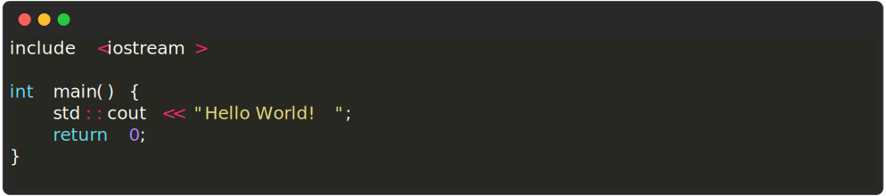
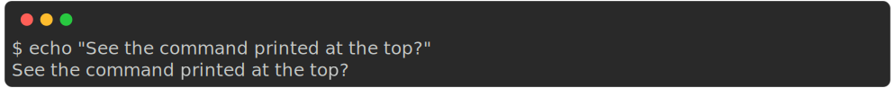
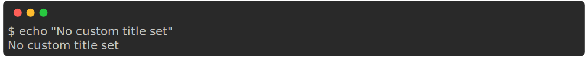
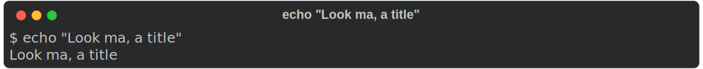
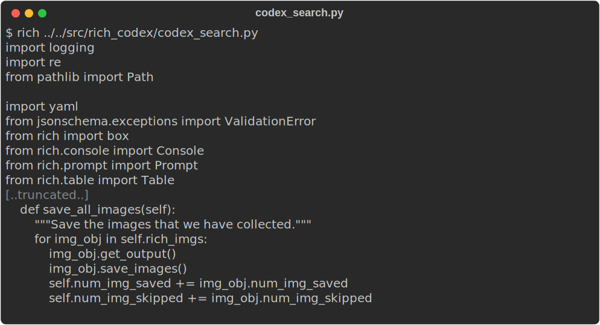

## Snippet syntax

If snippets can be parsed as JSON, they will be automatically reformatted (pretty-printed) and set to use JSON code syntax colouring. Otherwise they will be printed as white text by default.

To use coloured syntax highlighting on your non-JSON code snippets, you need to tell rich-codex what syntax to use with the `--snippet-syntax` / `$SNIPPET_SYNTAX` / `snippet_syntax` option (CLI, env var, action/config).

Syntax highlighting is done using [rich](https://rich.readthedocs.io/en/latest/syntax.html) which uses [Pygments](https://pygments.org). Any language [supported by Pygments](https://pygments.org/languages/) should work.

<!-- prettier-ignore-start -->
```markdown
<!-- RICH-CODEX
snippet_syntax: "C++"
snippet: |
    include <iostream>

    int main() {
        std::cout << "Hello World!";
        return 0;
    }
-->

```

<!-- prettier-ignore-end -->

## Hiding the command

By default, rich-codex shows a command prompt with the command that was used to generate the iamge.
This can be disabled by setting using `--hide-command` / `$HIDE_COMMAND` / `hide_command` (CLI, env var, action/config).

<!-- prettier-ignore-start -->
Default:

```markdown

```


With `hide_command` set to `true`:

```markdown
<!-- RICH-CODEX
hide_command: true
-->

```
<!-- RICH-CODEX
hide_command: true
-->

<!-- prettier-ignore-end -->

## Showing the command in the title

Rich-codex sets the title in the screenshot only if you provide it (config or as title text in the markdown image).
If you like you can tell rich-codex to always use a title, with the command (or fake command) used if the title is not explicitly set.

Do this with the `--title-command` / `$TITLE_COMMAND` / `title_command` (CLI, env var, action/config).

<!-- prettier-ignore-start -->
Default:

```markdown

```


With `title_command` set to `true`:

```markdown
<!-- RICH-CODEX title_command: true -->

```

<!-- prettier-ignore-end -->

## Truncating content

If your tool produces a lot of output you can show just the beginning or end of output.
You can set the number of lines of output that you would like to show using: _(CLI, env var, action/config)_

- `--head` / `$RC_HEAD` / `head`
- `--tail` / `$RC_TAIL` / `tail`

<!-- prettier-ignore-start -->
```markdown
<!-- RICH-CODEX { head: 10, tail: 8 } -->

```


If the number you set is larger than the amount of output then all output will be shown as usual.

!!! tip
    Remember that you can set both head _and_ tail to remove just the middle section of output 🚀
<!-- prettier-ignore-end -->

By default, if any output is truncated a line will be printed: `[..truncated..]`.
You can customise this text using `--truncated-text` / `$TRUNCATED_TEXT` / `truncated_text`.
Set it to `None` to omit the line completely.

## Trimming content

You can clean off unwanted content based on a string pattern match using `--trim-after` / `$TRIM_AFTER` / `trim_after`.

Set it to a string - if that string is found in the input, no more lines will be printed after that.

No `truncated_text` is shown for this method currently (could be added if anyone wants it).

<!-- prettier-ignore-start -->
```markdown
<!-- RICH-CODEX { trim_after: "class CodexSearch:", truncated_text: "Where did the rest of the file go? 🕵️‍♀️" } -->

```

<!-- prettier-ignore-end -->
