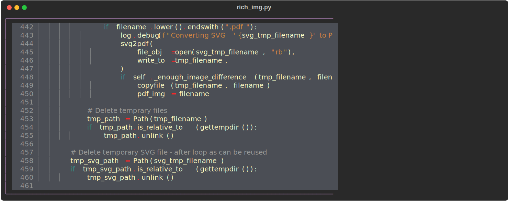
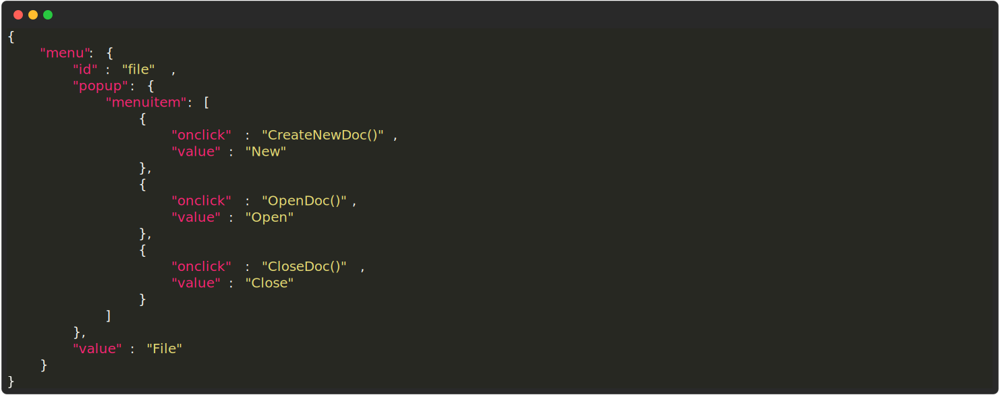
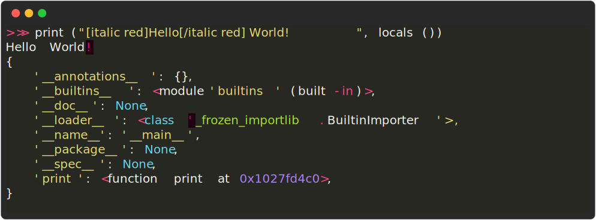

## Running commands

If you write markdown with images that contain _just_ a `backtick command` as the alt-text, rich-codex will find them.

For example, the following markdown will generate `../img/rich-codex-help.svg` (the image shown above) based on the output of the command `rich-codex --help`:

```markdown

```


## Printing files

Rich-codex bundles [rich-cli](https://github.com/Textualize/rich-cli) for convenience, so you can easily produce screenshots of files with the `rich` command:

<!-- prettier-ignore-start -->
!!! tip
    You probably want to hide the command with `hide_command` - see below for more about configuration.

```markdown
<!-- RICH-CODEX hide_command: true -->

```
<!-- RICH-CODEX hide_command: true -->


!!! tip
    💡 Use the `--force-terminal` flag to keep colours in your screenshots
<!-- prettier-ignore-end -->

## Title text

You can also add [title text](https://daringfireball.net/projects/markdown/syntax#img) in quotes after the filename, which will be used in the top menu bar of the screenshot terminal.
This can be useful when adding lots of command markup to get a good screenshot.
You might also want to hide the command prompt.
For example:

<!-- prettier-ignore-start -->
```markdown
You don't always want people to see the exact command you used, after all.
<!-- RICH-CODEX hide_command: true -->

```
<!-- prettier-ignore-end -->



## Config comments

Finally, you can use a HTML comment in a line above the image to set config attributes for this image only.
The comment should begin with `RICH-CODEX` and then have valid YAML after that.

The parsed configuration will be validated and is the same as used within [rich-codex config files](config_file.md).

For example:

<!-- prettier-ignore-start -->

```markdown
<!-- RICH-CODEX {terminal_width: 60, terminal_theme: MONOKAI} -->

```

<!-- RICH-CODEX {terminal_width: 60, terminal_theme: MONOKAI} -->


<!-- prettier-ignore-end -->

## Code snippets

In addition to running commands, you can format code blocks or "snippets".

To do this, make the `<!-- RICH-CODEX` code comment config with the `snippet` key.
Remember that you can use the pipe character `|` in YAML to have multi-line strings, but there must be correct indentation. I'd recommend you write the YAML in a code editor with syntax highlighting and then paste it in.

<!-- prettier-ignore-start -->

!!! info
    The alt-text for the markdown image embed doesn't matter for snippets. However, if it has a command in backticks then this will take priority over the snippet.

If the snippet is valid JSON, it will be pretty-printed and coloured. Otherwise text will default to white.

```markdown
<!-- RICH-CODEX snippet: |
  {"menu": {
    "id": "file", "value": "File",
    "popup": {
      "menuitem": [
        {"value": "New", "onclick": "CreateNewDoc()"},
        {"value": "Open", "onclick": "OpenDoc()"},
        {"value": "Close", "onclick": "CloseDoc()"}
      ]
    }
  }}
-->

```


For other code languages, use `snippet_syntax` to define which language to format in. For example:

```markdown
<!-- RICH-CODEX
snippet_syntax: python
terminal_width: 80
snippet: |
  >>> print("[italic red]Hello[/italic red] World!", locals())
  Hello World!
  {
      '__annotations__': {},
      '__builtins__': <module 'builtins' (built-in)>,
      '__doc__': None,
      '__loader__': <class '_frozen_importlib.BuiltinImporter'>,
      '__name__': '__main__',
      '__package__': None,
      '__spec__': None,
      'print': <function print at 0x1027fd4c0>,
  }
-->

```


!!! hint
    Note that all other key-value pairs above also work for snippets.

<!-- prettier-ignore-end -->
