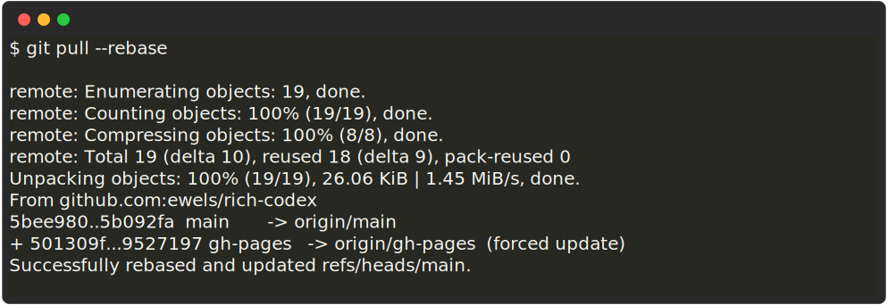
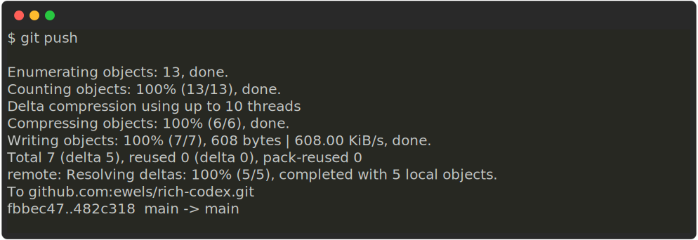

## No image generated

First up: did you remember the `!`? It's ``  `` - I've spent longer than I'd care to admit debugging only to realise I missed the leading `!` 🙈

Next, check the verbose log - it's saved as an artefact with GitHub Actions or locally you can use the `-v`/`--verbose` flag. The verbose log tells you which files are being searched and gives you more insight into what rich-codex is doing.

## Can't push new commits

If you're fairly new to using git, you might find this error message a bit intimidating when you first see it:

<!-- RICH-CODEX
fake_command: git push
-->

![`echo "\nTo github.com:ewels/rich-codex.git\n [red]! [rejected][/]        main -> main (fetch first)\n[red]error: failed to push some refs to 'github.com:ewels/rich-codex.git'[/]\n[yellow]hint: Updates were rejected because the remote contains work that you do[/]\n[yellow]hint: not have locally. This is usually caused by another repository pushing[/]\n[yellow]hint: to the same ref. You may want to first integrate the remote changes[/]\n[yellow]hint: (e.g., 'git pull ...') before pushing again.[/]\n[yellow]hint: See the 'Note about fast-forwards' in 'git push --help' for details.[/]" | rich - -p --force-terminal`](img/git-push-error.svg)

Fear not, what has likely happened is:

- Your rich-codex GitHub Action has run since you last pushed
- It created some new images and you have set it to automatically commit these new images to your repository
- Because of this, your git remote now has new commits that you don't yet have locally
- Git doesn't let you push your work until that's resolved

The fix is usually simple - you need to pull the new commits and tell git to _rebase_ your new work on top of that.
Git will shuffle the commits one in front of the other and then you'll be able to push without any issues:

<!-- RICH-CODEX
snippet: |
    $ git pull --rebase

    remote: Enumerating objects: 19, done.
    remote: Counting objects: 100% (19/19), done.
    remote: Compressing objects: 100% (8/8), done.
    remote: Total 19 (delta 10), reused 18 (delta 9), pack-reused 0
    Unpacking objects: 100% (19/19), 26.06 KiB | 1.45 MiB/s, done.
    From github.com:ewels/rich-codex
    5bee980..5b092fa  main       -> origin/main
    + 501309f...9527197 gh-pages   -> origin/gh-pages  (forced update)
    Successfully rebased and updated refs/heads/main.
-->

<!-- RICH-CODEX
snippet: |
    $ git push

    Enumerating objects: 13, done.
    Counting objects: 100% (13/13), done.
    Delta compression using up to 10 threads
    Compressing objects: 100% (6/6), done.
    Writing objects: 100% (7/7), 608 bytes | 608.00 KiB/s, done.
    Total 7 (delta 5), reused 0 (delta 0), pack-reused 0
    remote: Resolving deltas: 100% (5/5), completed with 5 local objects.
    To github.com:ewels/rich-codex.git
    fbbec47..482c318  main -> main
-->

