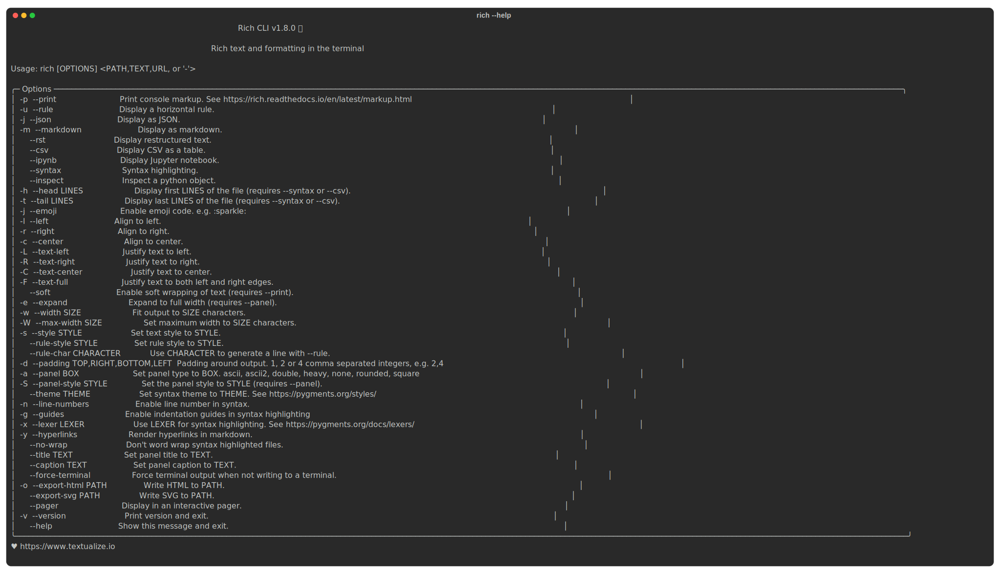

# My amazing documentation

This markdown file contains some HTML comments which do not render.
However, they instruct `rich-screenshot-action` to save images.
The markdown then includes image tags for the expected image filenames.

The terminal capture is handled by the Rich library and rich-cli package:

<!-- rich-codex cmd rich-cli-help.svg "rich --help" -->

The action uses [CairoSVG](https://cairosvg.org/) to generate PNG and PDF files:

<!-- rich-codex cmd cairo-help.png "cairosvg --help" -->

As well as commands, the action can take code snippets, which are auto-formatted by rich-cli:

<!-- rich-codex code example-json.svg
---
{"menu": {
  "id": "file", "value": "File",
  "popup": {
    "menuitem": [
      {"value": "New", "onclick": "CreateNewDoc()"},
      {"value": "Open", "onclick": "OpenDoc()"},
      {"value": "Close", "onclick": "CloseDoc()"}
    ]
  }
}}
-->

