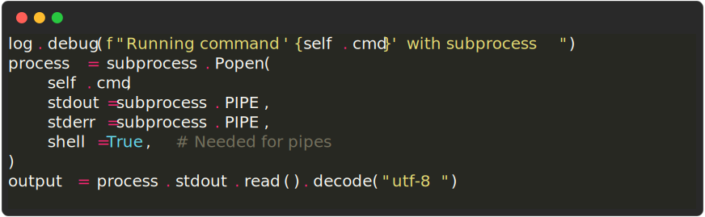

# My amazing documentation

This markdown file contains some HTML comments which do not render.
However, they instruct `rich-screenshot-action` to save images.
The markdown then includes image tags for the expected image filenames.

Markdown images that include a `inline code command` as the only alt-text will be discovered and rendered.
The terminal capture is handled by the Rich library:

Add a Markdown [image title string](https://daringfireball.net/projects/markdown/syntax#img) after the filename to customise the terminal window title:

You can use HTML comments to customise additional aspects of the generated image.
If you want rich-click to ignore an image, use a comment with `SKIP=true`

<!-- RICH-CODEX TERMINAL_THEME=MONOKAI -->

As well as commands, the action can take code snippets. Just make the `<!-- RICH-CODEX` code multi-line. Anything on subsequent lines before the closing `-->` will be treated as the snippet.

<!-- RICH-CODEX
{"menu": {
  "id": "file", "value": "File",
  "popup": {
    "menuitem": [
      {"value": "New", "onclick": "CreateNewDoc()"},
      {"value": "Open", "onclick": "OpenDoc()"},
      {"value": "Close", "onclick": "CloseDoc()"}
    ]
  }
}}
-->

Rich-codex will try to format JSON automatically, but other languages must be specified using `SNIPPET_SYNTAX`:

<!-- RICH-CODEX TERMINAL_WIDTH=70 SNIPPET_SYNTAX=python
log.debug(f"Running command '{self.cmd}' with subprocess")
process = subprocess.Popen(
    self.cmd,
    stdout=subprocess.PIPE,
    stderr=subprocess.PIPE,
    shell=True,  # Needed for pipes
)
output = process.stdout.read().decode("utf-8")
-->

